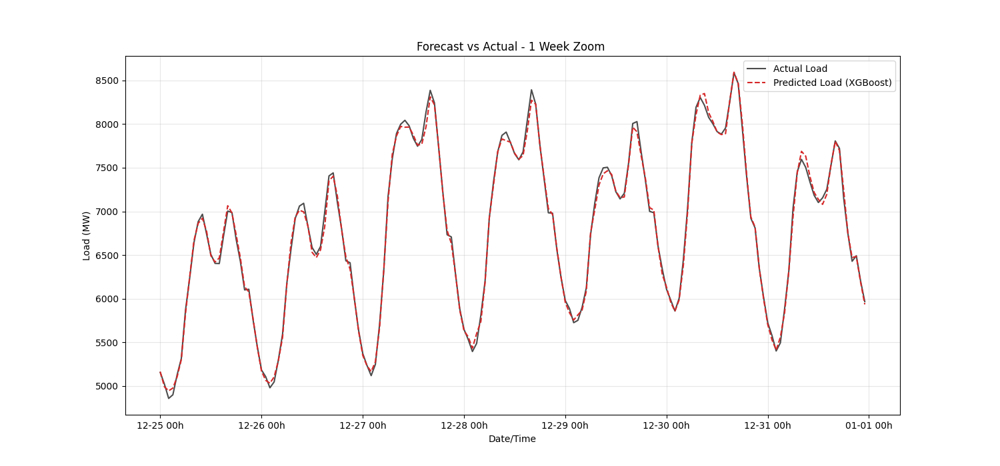
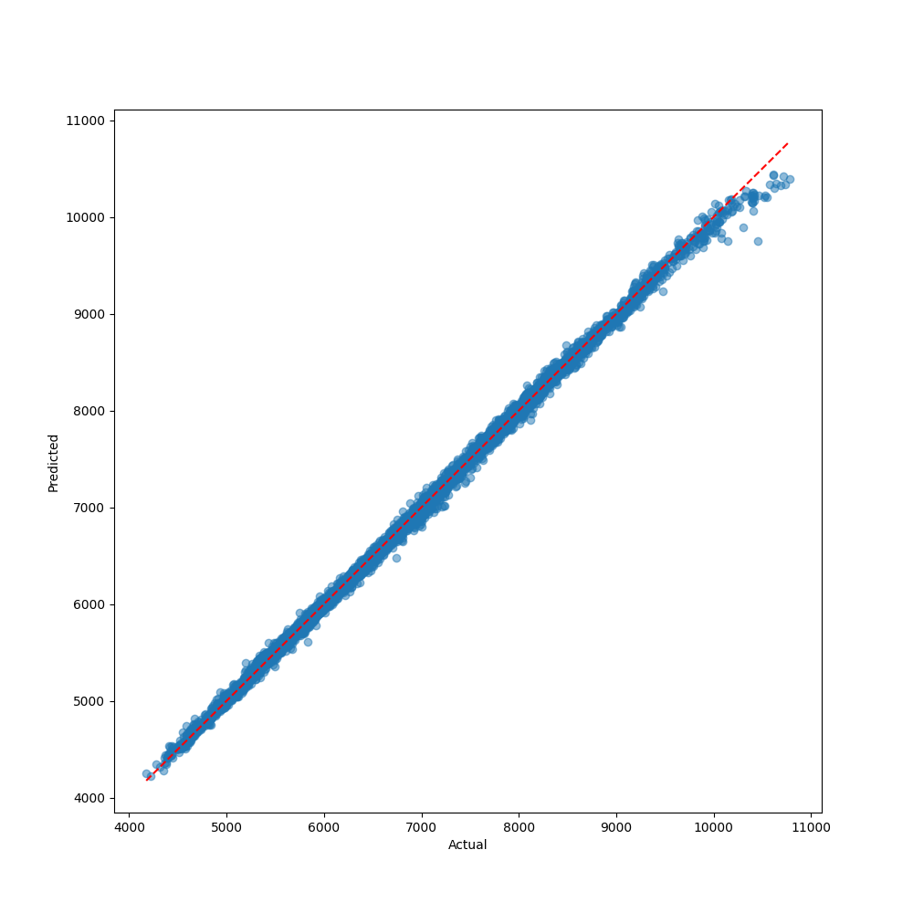
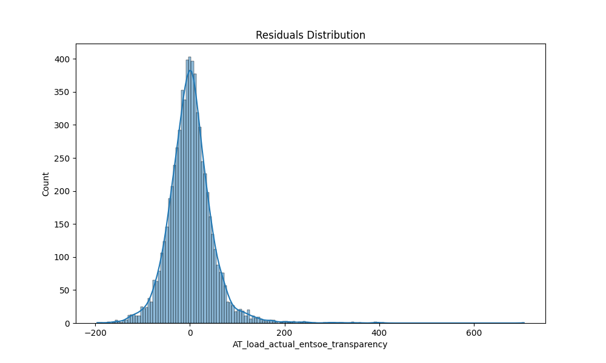
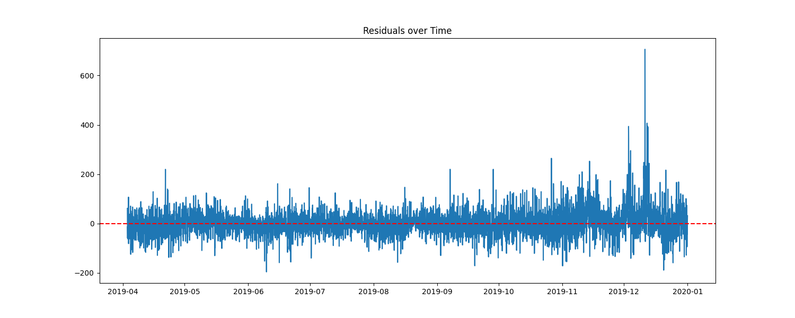
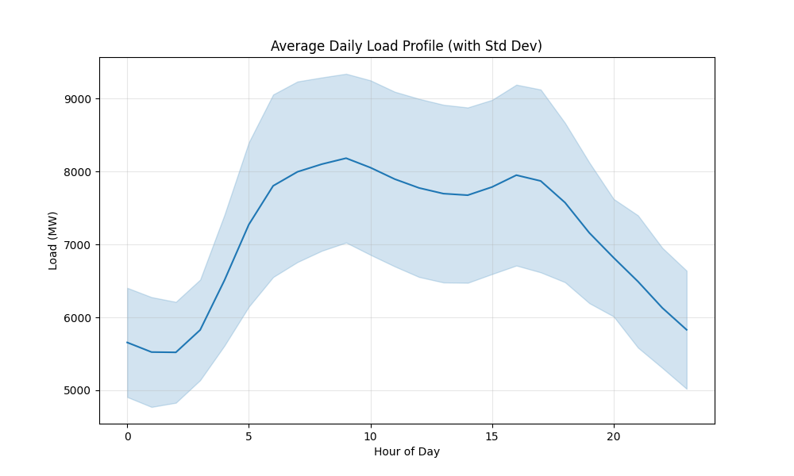
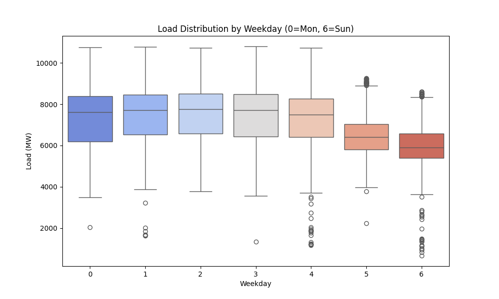
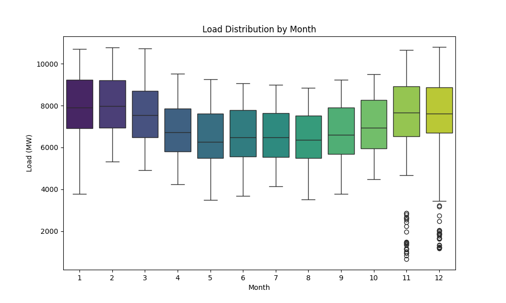
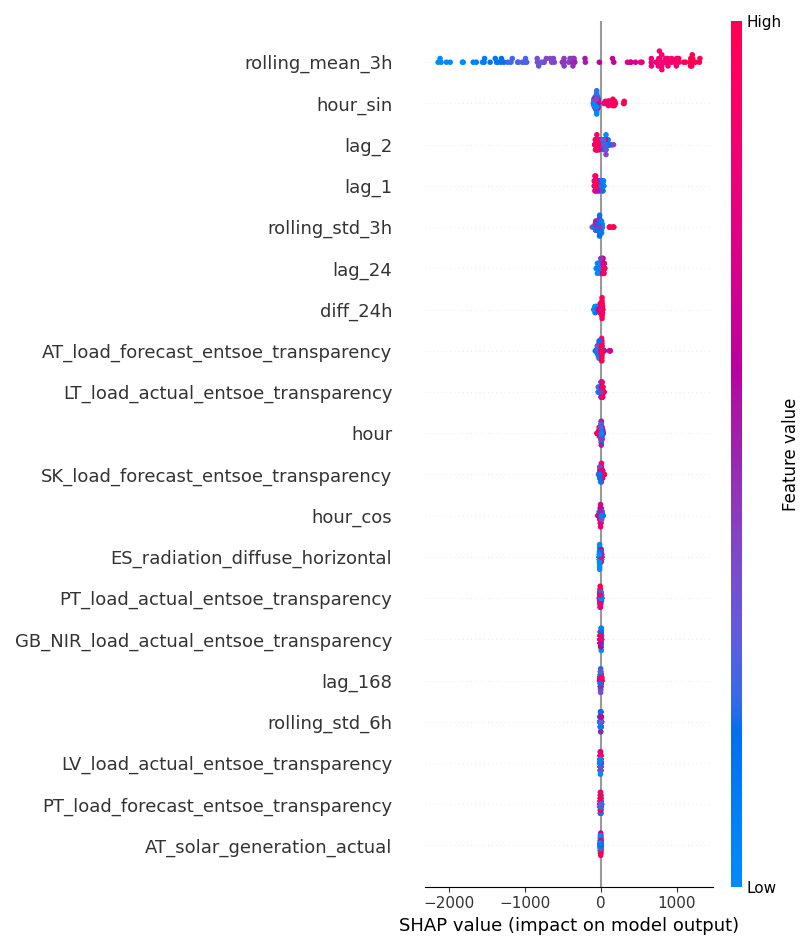
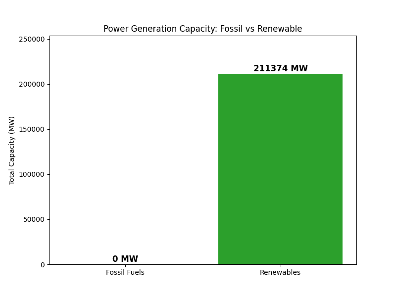

# Europe Load Forecasting & Carbon Proxy Project


## Project Overview
This project delivers an end-to-end Machine Learning solution for forecasting electricity load in Europe. It goes beyond simple forecasting by calculating a Carbon Proxy Score to estimate the carbon intensity of the grid based on the installed capacity of fossil vs. renewable energy sources.

The project includes:
- **Data Pipeline**: Automated loading and cleaning of OPSD data.
- **Feature Engineering**: Circular encoding of time features, lag features, and weather integration.
- **Modeling**: Comparative analysis of Baseline, Random Forest, and XGBoost models.
- **Explainability**: SHAP analysis to interpret model drivers.
- **Dashboard**: An interactive Streamlit app for real-time visualization.

## Data Sources
The data usage in this project comes from the Open Power System Data (OPSD) platform.

| Dataset | Source Link |
|---------|-------------|
| **Weather Data** | [OPSD Weather Data 2020-09-16](https://data.open-power-system-data.org/weather_data/2020-09-16) |
| **Conventional Power Plants** | [OPSD Conventional Power Plants 2020-10-01](https://data.open-power-system-data.org/conventional_power_plants/2020-10-01) |
| **Renewable Power Plants** | [OPSD Renewable Power Plants 2020-08-25](https://data.open-power-system-data.org/renewable_power_plants/2020-08-25) |
| **Time Series (Load/Wind/Solar)** | [OPSD Time Series](https://data.open-power-system-data.org/time_series/) |

The code expects these datasets to be downloaded and placed in the project root or `data/` directory.

## Repository Structure
```
├── data/                   # Raw & Processed Data
├── notebooks/              # Jupyter Notebooks for Analysis
│   ├── 01_data_download_clean.ipynb
│   ├── 02_eda_plots.ipynb
│   └── 03_modeling_forecast.ipynb
├── src/                    # Source Code
│   ├── data_loader.py      # Data ingestion
│   ├── preprocessing.py    # Cleaning & Outlier handling
│   ├── features.py         # Feature engineering (Lags, Weather, Carbon)
│   ├── train.py            # Model training (RF, XGBoost)
│   ├── evaluate.py         # Performance metrics & plots
│   ├── extra_plots.py      # Portfolio visualization generation
│   └── app.py              # Streamlit Dashboard
├── reports/                # Generated Figures & Metrics
│   └── figures/            # Saved plots (PNG)
├── models/                 # Saved Model Artifacts (.pkl)
├── requirements.txt        # Python Dependencies
└── README.md               # Project Documentation
```

## How to Run

### 1. Install Dependencies
```bash
pip install -r requirements.txt
```

### 2. Run Data Pipeline & Training
To process data, train the model, and generate basic evaluation plots:
```bash
python src/train.py
```

### 3. Generate Portfolio Visualizations
To create the advanced visualizations included in this report:
```bash
python src/extra_plots.py
```

### 4. Launch Dashboard
Explore the results interactively:
```bash
streamlit run src/app.py
```

## Model Performance

The XGBoost model achieved high accuracy in forecasting the electrical load.

| Metric | Value |
|--------|-------|
| **RMSE** | ~48.85 MW |
| **MAE** | ~34.05 MW |
| **MAPE** | ~0.49% |
| **R²** | 0.998 |

## Results & Analysis

### 1. Forecast Zoom (Actual vs Predicted)
A focused look at 1 week of predictions vs actual load, demonstrating the model's ability to capture daily peaks and nightly troughs with high precision.


### 2. Overall Model Fit
The scatter plot below compares predicted values against actual values. The tight alignment along the diagonal indicates a highly accurate model with minimal bias.


### 3. Residual Analysis
We analyze residuals to ensure no systematic errors remain. The histogram shows a normal distribution of errors centered around zero.


The residuals over time plot confirms that errors are consistent and stable across the timeline.


### 4. Seasonality Profiling
Understanding load behavior across different time scales is critical for forecasting.
**Hourly Profile**: Shows the daily demand curve with morning and evening peaks.


**Weekly & Monthly Distribution**: illustrates the variance in load across the week and throughout the year.
| Weekly Distribution | Monthly Distribution |
|:---:|:---:|
|  |  |

### 5. Feature Importance (SHAP)
This summary plot identifies the most influential features driving the model's predictions. Lag features and temperature are typically top drivers.


### 6. Energy Transition Context (Carbon Proxy)
To calculate the Carbon Proxy Score, we analyzed the installed capacity of Fossil Fuels vs Renewable Energy sources.


---
*Built with Python, Pandas, XGBoost, and Streamlit.*
